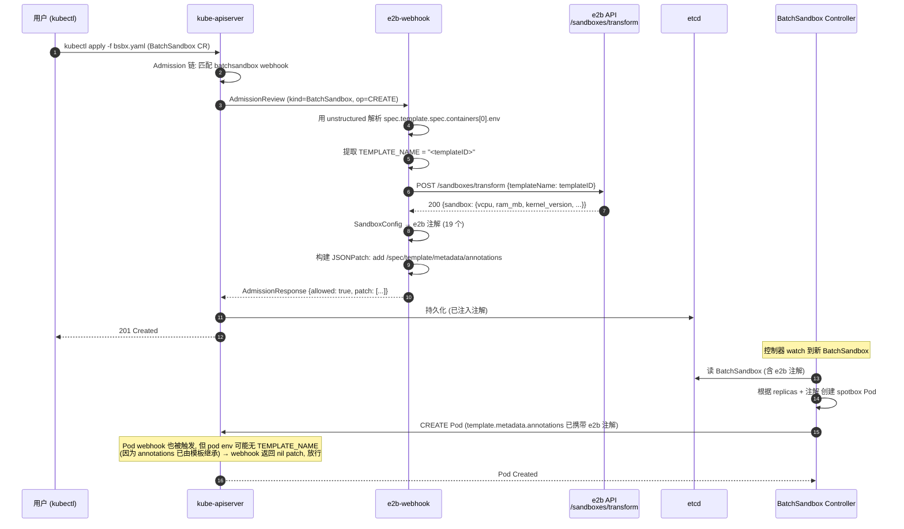
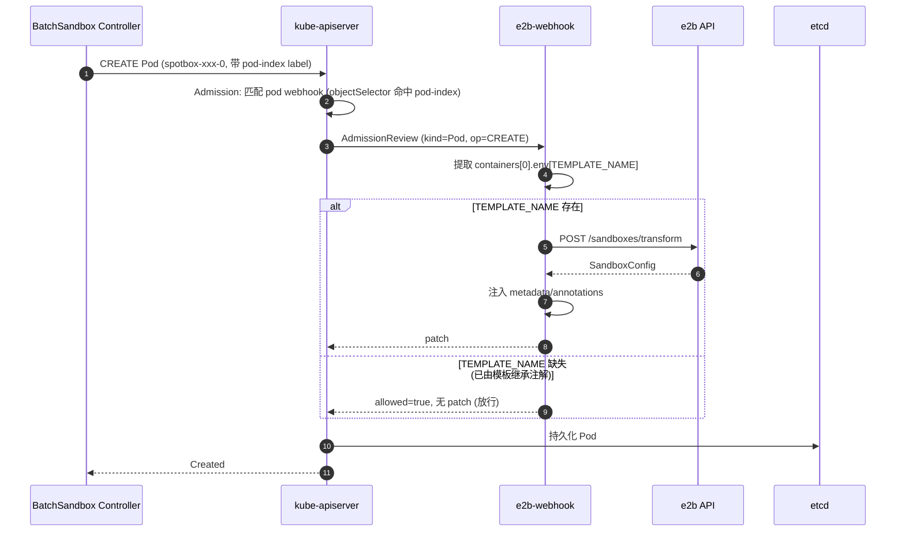
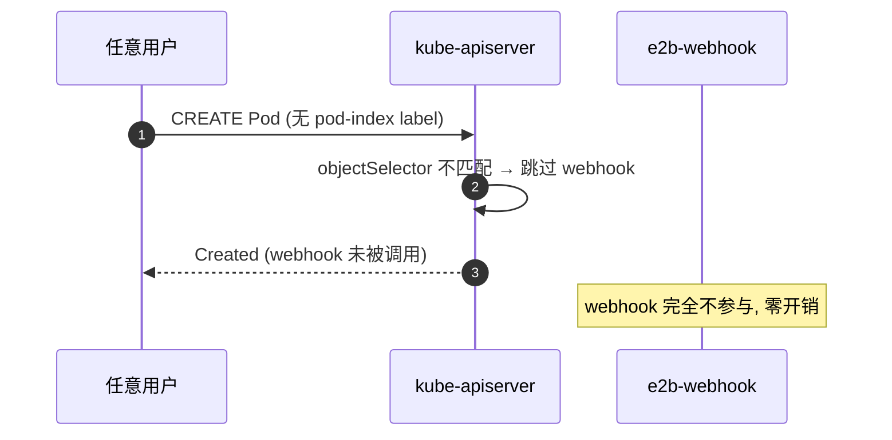

# e2b-webhook 方案设计

## 一、背景与目标

Kubernetes 集群中存在一种由 **BatchSandbox CRD** 控制器创建的 **spotbox Pod**（用于 e2b 沙箱环境）。这类 Pod 创建时需要根据其携带的 `TEMPLATE_NAME` 调用 e2b API（`POST /sandboxes/transform`），获取沙箱配置（vcpu、ram、kernel、firecracker 版本等）并以 **annotations** 形式注入到 Pod / BatchSandbox 模板，供后续控制器（BatchSandbox controller）读取并据此创建真正运行 firecracker 的沙箱实例。

**目标**：用 Mutating Admission Webhook 在资源 CREATE 阶段透明完成注解注入，无需修改下游控制器。

---

## 二、方案架构

### 组件角色

| 组件 | 角色 | 说明 |
|------|------|------|
| **用户 / 控制器** | 资源创建者 | 提交 BatchSandbox CR 或由其衍生 spotbox Pod |
| **kube-apiserver** | Admission 链 | CREATE 时先调用 webhook，再持久化 |
| **e2b-webhook** | Mutating Webhook | 本服务，注入注解 |
| **e2b API** | 外部服务 | `POST /sandboxes/transform` 返回 SandboxConfig |
| **BatchSandbox Controller** | 下游控制器 | 读取注解创建 firecracker 实例（不在本方案范围） |

### 处理的两类资源

| 资源 | Webhook 名 | 触发条件 | 模板来源 |
|------|------------|----------|----------|
| **BatchSandbox** (CR) | `batchsandbox.e2b-webhook.e2b.dev` | CREATE，`failurePolicy: Ignore` | `spec.template.spec.containers[0].env[TEMPLATE_NAME]` |
| **Pod** | `pod.e2b-webhook.e2b.dev` | CREATE + `objectSelector: pod-index exists`，`failurePolicy: Fail` | `spec.containers[0].env[TEMPLATE_NAME]` |

> Pod webhook 只拦截由 BatchSandbox 控制器创建的 spotbox Pod（带 `batch-sandbox.sandbox.opensandbox.io/pod-index` label），避免对所有 Pod 调用 API。

### 注入路径（basePath 区别）

| 资源 | annotations 写入路径 |
|------|---------------------|
| BatchSandbox | `spec/template/metadata/annotations` |
| Pod | `metadata/annotations` |

---

## 三、时序图

### 场景 A：用户创建 BatchSandbox（主路径）



### 场景 B：BatchSandbox Controller 创建 spotbox Pod



### 场景 C：非 spotbox Pod（被 objectSelector 过滤）



---

## 四、核心数据流

```
BatchSandbox CR
    │
    ▼
spec.template.spec.containers[0].env[]
    │  找到 NAME==TEMPLATE_NAME
    ▼
templateID (e.g. "a6lr4j5i11qfunq1q71v")
    │
    ▼  POST /sandboxes/transform
    │  body: {"templateName": "a6lr4j5i11qfunq1q71v"}
    ▼
e2b API 返回 SandboxConfig {
    template_id, build_id, vcpu, ram_mb,
    kernel_version, firecracker_version,
    envd_version, huge_pages, total_disk_size_mb, ...
}
    │
    ▼  toE2BAnnotations()
    ▼
map[string]string (23 个 e2b.dev/* 注解)
    │
    ▼  JSONPatch "add"
    ▼
spec.template.metadata.annotations (BatchSandbox)
  或
metadata.annotations (Pod)
```

---

## 五、注入的注解清单

> 以下注解由 [annotations.go](annotations.go) 的 `toE2BAnnotations()` 生成，共 23 个（`metadata`/`sandbox-id` 为空时省略）。

| 注解 key | 来源字段 | 示例值 |
|----------|----------|--------|
| `e2b.dev/base_template_id` | BaseTemplateID | `a6lr4j5i11qfunq1q71v` |
| `e2b.dev/template-id` | TemplateID | `a6lr4j5i11qfunq1q71v` |
| `e2b.dev/build-id` | BuildID | `b3f9e3c6-7d2a-4b1e-9c8f-1a2b3c4d5e6f` |
| `e2b.dev/team-id` | TeamID | `team-abc123` |
| `e2b.dev/vcpu` | Vcpu | `2` |
| `e2b.dev/ram-mb` | RAMMB | `2048` |
| `e2b.dev/total-disk-size-mb` | TotalDiskSizeMB | `940` |
| `e2b.dev/max-sandbox-length` | MaxSandboxLength | `3600` |
| `e2b.dev/huge-pages` | HugePages | `true` |
| `e2b.dev/auto-pause` | AutoPause | `false` |
| `e2b.dev/snapshot` | Snapshot | `false` |
| `e2b.dev/envd-version` | EnvdVersion | `0.5.3` |
| `e2b.dev/kernel-version` | KernelVersion | `vmlinux-6.1.158` |
| `e2b.dev/firecracker-version` | FirecrackerVersion | `v1.13.1` |
| `e2b.dev/execution-id` | ExecutionID | `exec-9f8e7d6c` |
| `e2b.dev/allow-internet` | AllowInternetAccess（nil→`false`） | `true` |
| `e2b.dev/envd-access-token` | EnvdAccessToken（nil→`""`） | `eyJhbGciOi...` |
| `e2b.dev/network` | Network（JSON，空→`{"egress":{},"ingress":{}}`） | `{"egress":{"allowedCidrs":["0.0.0.0/0"]},"ingress":{}}` |
| `e2b.dev/env-vars` | EnvVars（JSON，空→`{}`） | `{"PATH":"/usr/local/bin:/usr/bin:/bin"}` |
| `e2b.dev/volume-mounts` | VolumeMounts（JSON，空→`[]`） | `[]` |
| `e2b.dev/auto-resume` | AutoResume（JSON，nil→`{"policy":"off"}`） | `{"policy":"off"}` |
| `e2b.dev/metadata` | Metadata（JSON，空时省略） | `{"owner":"alice"}` |
| `e2b.dev/sandbox-id` | SandboxID（空时省略） | `i0x1x7jk8qdux6b9f2pu1` |

---

## 六、关键设计决策

| 决策 | 理由 |
|------|------|
| **不缓存 API 结果** | 每次都发新请求，保证沙箱配置实时性（build 可能更新） |
| **Pod webhook 用 objectSelector 过滤** | 避免拦截所有 Pod 造成 API 压力和误注入 |
| **BatchSandbox webhook `failurePolicy: Ignore`** | CRD 注册前不阻塞其他资源；API 失败不阻塞创建（注解缺失可后续补） |
| **Pod webhook `failurePolicy: Fail`** | 已通过 objectSelector 精确匹配 spotbox，失败即报错暴露问题 |
| **用 unstructured 处理 CRD** | 避免在 Scheme 注册 BatchSandbox 类型，降低耦合 |
| **annotations 注入而非 env** | 下游控制器已约定从 annotations 读取，且 annotations 不会被容器进程可见，更安全 |
| **从 `containers[0].env[TEMPLATE_NAME]` 提取** | 与 e2b 现有 CLI/SDK 约定一致，用户在模板里写 env 即可 |

---

## 七、可靠性设计

- **幂等 patch**：用 `add` 操作，若 annotations 已存在则 `replace`，重复调用安全
- **e2bAnnotations 为空时跳过 patch**：API 返回空或 Pod 无 TEMPLATE_NAME 时返回 nil patch，放行不报错
- **超时保护**：HTTP client `timeout=5s`，webhook `timeoutSeconds=5`
- **TLS 双向验证**：kube-apiserver 用 caBundle 校验 webhook 服务端证书
- **健康检查**：`/healthz` 端点供 liveness/readiness 探针使用

---

## 八、部署清单

| 资源 | 名称 | 说明 |
|------|------|------|
| Namespace | `e2b-webhook` | 独立命名空间 |
| Deployment | `e2b-webhook` | 2 副本，arm64 镜像 |
| Service | `e2b-webhook` | 443→8443，集群内访问 |
| Secret | `e2b-webhook-tls` | TLS 证书 |
| Secret | `e2b-api-key` | E2B_API_KEY (optional) |
| MutatingWebhookConfiguration | `e2b-webhook` | 两个 webhook 规则 |
| CRD | `batchsandboxes.sandbox.opensandbox.io` | 已注册 |

### 镜像信息

- 仓库：`193.13.1.2:2900/e2b-orchestration/e2b-webhook:latest`
- 架构：`linux/arm64`
- 基础镜像：`scratch`（静态编译，无依赖）

### 环境变量

| 变量 | 默认值 | 说明 |
|------|--------|------|
| `PORT` | `8443` | HTTPS 监听端口 |
| `TLS_CERT_FILE` | `/tls/tls.crt` | TLS 证书路径 |
| `TLS_KEY_FILE` | `/tls/tls.key` | TLS 私钥路径 |
| `E2B_API_URL` | `http://api.e2b.svc.cluster.local:3000` | e2b API 地址 |
| `E2B_API_KEY` | (secret) | e2b API 密钥 |
| `E2B_API_TIMEOUT` | `5s` | API 调用超时 |

---

## 九、创建示例

```yaml
apiVersion: sandbox.opensandbox.io/v1alpha1
kind: BatchSandbox
metadata:
  name: my-sandbox-1
  namespace: test
spec:
  replicas: 1
  expireTime: "2026-08-14T00:00:00Z"
  template:
    metadata: {}
    spec:
      runtimeClassName: e2b
      restartPolicy: Never
      containers:
        - name: sandbox
          image: registry-hulk.sankuai.com/system_test/mtos:offline_251113_x86
          env:
            - name: TEMPLATE_NAME        # webhook 据此调用 transform API
              value: "a6lr4j5i11qfunq1q71v"
            - name: ENVD_PORT
              value: "3999"
          resources:
            limits: { cpu: "1", memory: 1Gi }
            requests: { cpu: "1", memory: 1Gi }
```

创建后 `spec.template.metadata.annotations` 自动注入 19 个 `e2b.dev/*` 注解。

### 验证命令

```bash
# 查看注入的注解
kubectl -n test get batchsandbox my-sandbox-1 \
  -o jsonpath='{.spec.template.metadata.annotations}' | python3 -m json.tool

# 查看 webhook 日志
kubectl -n e2b-webhook logs deploy/e2b-webhook --tail=50

# 查看 webhook 配置
kubectl get mutatingwebhookconfiguration e2b-webhook -o yaml
```

---

## 十、代码结构

```
e2b-webhook/
├── main.go                  # 入口，HTTP server + Admission handler
├── annotations.go           # 核心逻辑：提取 templateID、调用 API、生成注解
├── main_test.go             # 单元测试
├── go.mod                   # Go 模块定义
├── Dockerfile.scratch       # 镜像构建（scratch 基础）
├── batchsandbox.yaml        # BatchSandbox 资源示例
├── spot-pod.yaml            # spotbox Pod 示例（参考）
└── deploy/
    ├── deployment.yaml      # K8s 部署清单（Namespace/Deployment/Service/Webhook）
    └── deploy.sh            # 部署脚本（构建镜像、生成证书、注入 caBundle）
```

### 核心函数

| 函数 | 位置 | 说明 |
|------|------|------|
| `serveMutate` | main.go | HTTP handler，分发 Pod / BatchSandbox 请求 |
| `admitPod` | main.go | 处理 Pod AdmissionReview |
| `admitBatchSandbox` | main.go | 处理 BatchSandbox AdmissionReview |
| `FetchForPod` | annotations.go | 从 Pod env 提取 TEMPLATE_NAME 并调用 API |
| `FetchForBatchSandbox` | annotations.go | 从 BatchSandbox 提取 TEMPLATE_NAME 并调用 API |
| `callTransformAPI` | annotations.go | 调用 `POST /sandboxes/transform` |
| `toE2BAnnotations` | annotations.go | SandboxConfig → e2b 注解 map |
| `buildPatch` | main.go | 构建 JSONPatch 操作 |
| `extractTemplateNameFromPodEnv` | annotations.go | 从 Pod containers[0].env 提取 TEMPLATE_NAME |
| `extractTemplateNameFromBatchSandbox` | annotations.go | 从 BatchSandbox unstructured 提取 TEMPLATE_NAME |

---

## 十一、测试用例

本节给出三个典型场景的 **原始 YAML**（用户提交）与 **Webhook 处理后 YAML**（持久化到 etcd）对照，便于理解注入行为。

> 以下 YAML 中的 templateID、buildID、token 等均为示例值；`e2b.dev/*` 注解由 `POST /sandboxes/transform` 返回的 `SandboxConfig` 经 `toE2BAnnotations()` 转换生成。

### 11.1 场景一：BatchSandbox 创建（主路径）

#### 原始 YAML（用户提交）

```yaml
apiVersion: sandbox.opensandbox.io/v1alpha1
kind: BatchSandbox
metadata:
  name: my-sandbox-1
  namespace: test
spec:
  replicas: 1
  expireTime: "2026-08-14T00:00:00Z"
  template:
    metadata: {}
    spec:
      runtimeClassName: e2b
      restartPolicy: Never
      containers:
        - name: sandbox
          image: registry-hulk.sankuai.com/system_test/mtos:offline_251113_x86
          env:
            - name: TEMPLATE_NAME
              value: "a6lr4j5i11qfunq1q71v"
            - name: ENVD_PORT
              value: "3999"
          resources:
            limits: { cpu: "1", memory: 1Gi }
            requests: { cpu: "1", memory: 1Gi }
```

#### Webhook 处理后 YAML（etcd 持久化）

```yaml
apiVersion: sandbox.opensandbox.io/v1alpha1
kind: BatchSandbox
metadata:
  name: my-sandbox-1
  namespace: test
spec:
  replicas: 1
  expireTime: "2026-08-14T00:00:00Z"
  template:
    metadata:
      annotations:
        e2b.dev/base_template_id: "a6lr4j5i11qfunq1q71v"
        e2b.dev/template-id: "a6lr4j5i11qfunq1q71v"
        e2b.dev/build-id: "b3f9e3c6-7d2a-4b1e-9c8f-1a2b3c4d5e6f"
        e2b.dev/team-id: "team-abc123"
        e2b.dev/vcpu: "2"
        e2b.dev/ram-mb: "2048"
        e2b.dev/total-disk-size-mb: "940"
        e2b.dev/max-sandbox-length: "3600"
        e2b.dev/huge-pages: "true"
        e2b.dev/auto-pause: "false"
        e2b.dev/snapshot: "false"
        e2b.dev/envd-version: "0.5.3"
        e2b.dev/kernel-version: "vmlinux-6.1.158"
        e2b.dev/firecracker-version: "v1.13.1"
        e2b.dev/execution-id: "exec-9f8e7d6c"
        e2b.dev/allow-internet: "true"
        e2b.dev/envd-access-token: "eyJhbGciOiJIUzI1NiIsInR5cCI6IkpXVCJ9..."
        e2b.dev/network: '{"egress":{"allowedCidrs":["0.0.0.0/0"]},"ingress":{}}'
        e2b.dev/env-vars: '{"PATH":"/usr/local/bin:/usr/bin:/bin"}'
        e2b.dev/volume-mounts: "[]"
        e2b.dev/auto-resume: '{"policy":"off"}'
    spec:
      runtimeClassName: e2b
      restartPolicy: Never
      containers:
        - name: sandbox
          image: registry-hulk.sankuai.com/system_test/mtos:offline_251113_x86
          env:
            - name: TEMPLATE_NAME
              value: "a6lr4j5i11qfunq1q71v"
            - name: ENVD_PORT
              value: "3999"
          resources:
            limits: { cpu: "1", memory: 1Gi }
            requests: { cpu: "1", memory: 1Gi }
```

**变更点**：
- `spec.template.metadata.annotations` 新增 22 个 `e2b.dev/*` 注解
- 其余字段保持不变（用户已显式设置 `runtimeClassName: e2b`，webhook 不覆盖）

**对应 JSONPatch**：
```json
[
  {
    "op": "add",
    "path": "/spec/template/metadata/annotations",
    "value": {
      "e2b.dev/base_template_id": "a6lr4j5i11qfunq1q71v",
      "e2b.dev/template-id": "a6lr4j5i11qfunq1q71v",
      "...": "...（共 22 个）"
    }
  }
]
```

---

### 11.2 场景二：spotbox Pod 创建（BatchSandbox Controller 衍生）

#### 原始 YAML（Controller 提交）

```yaml
apiVersion: v1
kind: Pod
metadata:
  name: spotbox-my-sandbox-1-0
  namespace: test
  labels:
    batch-sandbox.sandbox.opensandbox.io/pod-index: "0"
spec:
  restartPolicy: Never
  containers:
    - name: sandbox
      image: registry-hulk.sankuai.com/system_test/mtos:offline_251113_x86
      env:
        - name: TEMPLATE_NAME
          value: "a6lr4j5i11qfunq1q71v"
        - name: ENVD_PORT
          value: "3999"
      resources:
        limits: { cpu: "1", memory: 1Gi }
        requests: { cpu: "1", memory: 1Gi }
```

#### Webhook 处理后 YAML（etcd 持久化）

```yaml
apiVersion: v1
kind: Pod
metadata:
  name: spotbox-my-sandbox-1-0
  namespace: test
  labels:
    batch-sandbox.sandbox.opensandbox.io/pod-index: "0"
  annotations:
    e2b.dev/base_template_id: "a6lr4j5i11qfunq1q71v"
    e2b.dev/template-id: "a6lr4j5i11qfunq1q71v"
    e2b.dev/build-id: "b3f9e3c6-7d2a-4b1e-9c8f-1a2b3c4d5e6f"
    e2b.dev/team-id: "team-abc123"
    e2b.dev/vcpu: "2"
    e2b.dev/ram-mb: "2048"
    e2b.dev/total-disk-size-mb: "940"
    e2b.dev/max-sandbox-length: "3600"
    e2b.dev/huge-pages: "true"
    e2b.dev/auto-pause: "false"
    e2b.dev/snapshot: "false"
    e2b.dev/envd-version: "0.5.3"
    e2b.dev/kernel-version: "vmlinux-6.1.158"
    e2b.dev/firecracker-version: "v1.13.1"
    e2b.dev/execution-id: "exec-9f8e7d6c"
    e2b.dev/allow-internet: "true"
    e2b.dev/envd-access-token: "eyJhbGciOiJIUzI1NiIsInR5cCI6IkpXVCJ9..."
    e2b.dev/network: '{"egress":{"allowedCidrs":["0.0.0.0/0"]},"ingress":{}}'
    e2b.dev/env-vars: '{"PATH":"/usr/local/bin:/usr/bin:/bin"}'
    e2b.dev/volume-mounts: "[]"
    e2b.dev/auto-resume: '{"policy":"off"}'
spec:
  runtimeClassName: e2b
  restartPolicy: Never
  containers:
    - name: sandbox
      image: registry-hulk.sankuai.com/system_test/mtos:offline_251113_x86
      env:
        - name: TEMPLATE_NAME
          value: "a6lr4j5i11qfunq1q71v"
        - name: ENVD_PORT
          value: "3999"
      resources:
        limits: { cpu: "1", memory: 1Gi }
        requests: { cpu: "1", memory: 1Gi }
```

**变更点**：
- `metadata.annotations` 新增 22 个 `e2b.dev/*` 注解
- `spec.runtimeClassName` 注入为 `e2b`（原 Pod 未设置）

**对应 JSONPatch**：
```json
[
  {
    "op": "add",
    "path": "/metadata/annotations",
    "value": { "e2b.dev/template-id": "a6lr4j5i11qfunq1q71v", "...": "..." }
  },
  {
    "op": "add",
    "path": "/spec/runtimeClassName",
    "value": "e2b"
  }
]
```

---

### 11.3 场景三：Android 沙箱 Pod（跳过 e2b API）

带有 `ANDROID_SANDBOX=true` 环境变量的 Pod，webhook 仅注入 `runtimeClassName: android`，**不调用 `/sandboxes/transform`，也不注入任何 `e2b.dev/*` 注解**。

#### 原始 YAML（用户提交）

```yaml
apiVersion: v1
kind: Pod
metadata:
  name: android-sandbox-1
  namespace: test
  labels:
    batch-sandbox.sandbox.opensandbox.io/pod-index: "0"
spec:
  restartPolicy: Never
  containers:
    - name: sandbox
      image: registry-hulk.sankuai.com/system_test/mtos:offline_251113_arm64
      env:
        - name: TEMPLATE_NAME
          value: "android-tpl-001"
        - name: ANDROID_SANDBOX
          value: "true"
      resources:
        limits: { cpu: "2", memory: 2Gi }
        requests: { cpu: "2", memory: 2Gi }
```

#### Webhook 处理后 YAML（etcd 持久化）

```yaml
apiVersion: v1
kind: Pod
metadata:
  name: android-sandbox-1
  namespace: test
  labels:
    batch-sandbox.sandbox.opensandbox.io/pod-index: "0"
spec:
  runtimeClassName: android
  restartPolicy: Never
  containers:
    - name: sandbox
      image: registry-hulk.sankuai.com/system_test/mtos:offline_251113_arm64
      env:
        - name: TEMPLATE_NAME
          value: "android-tpl-001"
        - name: ANDROID_SANDBOX
          value: "true"
      resources:
        limits: { cpu: "2", memory: 2Gi }
        requests: { cpu: "2", memory: 2Gi }
```

**变更点**：
- 仅注入 `spec.runtimeClassName: android`
- 无 `e2b.dev/*` 注解
- 未调用 e2b API（零外部依赖，快速返回）

**对应 JSONPatch**：
```json
[
  {
    "op": "add",
    "path": "/spec/runtimeClassName",
    "value": "android"
  }
]
```

---

### 11.4 边界场景

| 场景 | 输入 | Webhook 行为 | 输出 patch |
|------|------|--------------|-----------|
| 非 CREATE 操作 | `operation=Update/Delete/Connect` | 直接放行 | 无 patch |
| Pod 已有部分 e2b 注解 | `annotations` 含 `e2b.dev/vcpu=4` | 仅注入缺失项，不覆盖已有值 | `add` 缺失的 key |
| Pod 已设置 runtimeClassName | `spec.runtimeClassName` 非 nil | 不覆盖 | 无 runtimeClassName patch |
| TEMPLATE_NAME 缺失 | spotbox Pod 无 `TEMPLATE_NAME` env | 调用 API 返回空注解 → 放行 | 无 patch（或仅 runtimeClassName） |
| e2b API 超时/失败 | `/sandboxes/transform` 5xx/超时 | 容错返回空注解 → 仍注入 `runtimeClassName: e2b` | 仅 runtimeClassName |
| JSON 解码失败 | AdmissionReview.Object.Raw 非法 JSON | 拒绝创建 | `allowed: false` + 错误信息 |
| 非 Pod / 非 BatchSandbox 资源 | `kind=ConfigMap` 等 | 直接放行 | 无 patch |
| `/mutate` 非 POST 请求 | `method=GET` | HTTP 405 | — |
| Content-Type 非 JSON | `Content-Type: text/plain` | HTTP 415 | — |

---

### 11.5 单元测试覆盖

详见 [main_test.go](main_test.go)，主要测试函数：

| 测试函数 | 覆盖点 |
|----------|--------|
| `TestAdmitPod_Create` | Pod CREATE 注入注解 + runtimeClassName=e2b |
| `TestAdmitPod_AndroidSandbox` | ANDROID_SANDBOX=true 跳过 API，仅注入 runtimeClassName=android |
| `TestAdmitPod_NonCreate` | Update/Delete/Connect 直接放行 |
| `TestAdmitPod_MalformedJSON` | 非法 JSON 返回拒绝 |
| `TestAdmitPod_PartialE2BAnnotations` | 已有注解不被覆盖 |
| `TestAdmitBatchSandbox_Create` | BatchSandbox CREATE 注入模板注解 |
| `TestAdmitBatchSandbox_PartialAnnotations` | 模板已有注解时不覆盖 |
| `TestBuildPatch_*` | JSONPatch 构造逻辑（空、已有、全存在、自定义路径、JSON 序列化） |
| `TestEscapeJSONPointer` | RFC 6901 转义（`/`→`~1`、`~`→`~0`） |
| `TestServeMutate_*` | HTTP 分发、方法/Content-Type 校验、nil 请求 |
| `TestServeHealth` | `/healthz` 端点 |
| `TestSandboxConfig_ToE2BAnnotations` | SandboxConfig → 22 个注解完整映射 |
| `TestExtractTemplateNameFromBatchSandbox_*` | TEMPLATE_NAME 提取（成功/缺失/空值/无容器） |

运行测试：
```bash
cd e2b-webhook
GOWORK=off go test ./... -v
```

---

> **注**：以上 mermaid 时序图需在支持 mermaid 的 markdown 渲染器中查看。若 IDE 不渲染，可复制到 [mermaid.live](https://mermaid.live) 预览。
