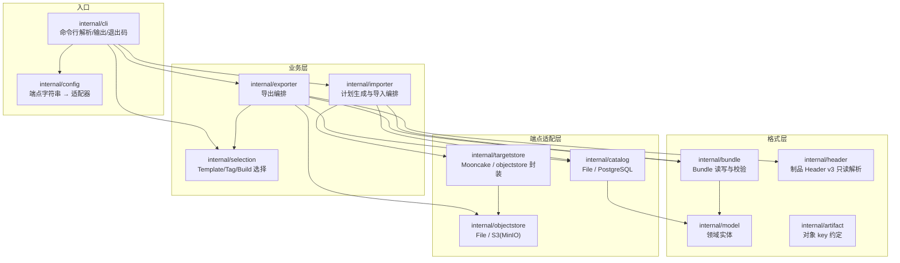
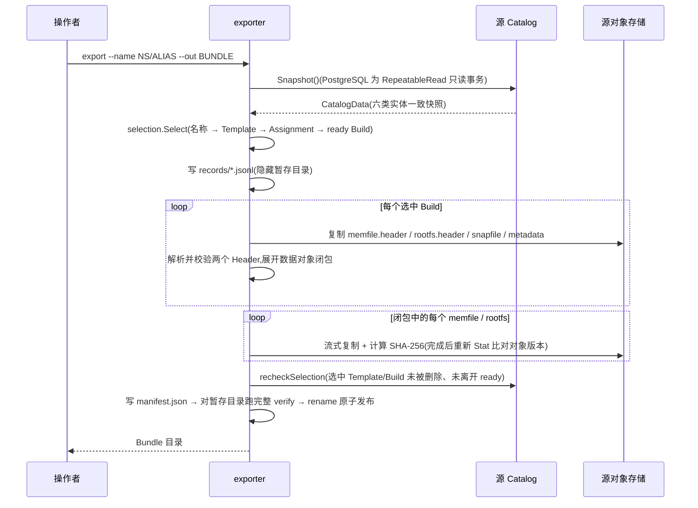

# template-migrate 设计文档

本文描述 `template-migrate` 的代码架构、功能边界、导入导出流程与关键设计
决策。命令用法见 [usage.md](usage.md),项目简介见 [README.md](README.md)。

---

## 一、目标与设计原则

工具解决一个问题:把 E2B/KASandbox 部署 A 中的 Template(及其 ready Build
的全部制品)搬到部署 B,搬完后 B 的运行时能直接用它启动 sandbox。

贯穿全部实现的原则:

1. **ID 跨环境恒定**:Template ID、Build UUID、时间戳等身份属性原样保留,
   只有环境归属(Team/Cluster)重新绑定。这是幂等重跑与冲突检测的基础。
2. **只增不改(additive-only)**:导入只插入目标缺失的行/对象,绝不 UPDATE
   或覆盖;已存在的内容要么逐字段/逐字节一致(可复用),要么就是冲突。
3. **默认 dry-run**:`import` 不加 `--apply` 只产出计划;有任何冲突时不写
   任何数据,以退出码 `2` 结束。
4. **导入前强制完整校验**:对象大小、SHA-256、Header 依赖闭包全部通过才
   进入计划阶段。
5. **凭证不落盘**:连接凭证不进入 URI、Bundle、报告与命令历史(PostgreSQL
   走 `PGPASSWORD`/`~/.pgpass`,S3 走 AWS SDK 凭证链)。
6. **格式严格同版本**:Bundle manifest `v1`、制品 Header `v3`、PostgreSQL
   schema baseline 逐一校验,不认识的版本一律显式拒绝,不做跨版本兼容。

## 二、代码架构



各包职责与要点:

| 包 | 职责 | 要点 |
| --- | --- | --- |
| `cli` | 六个子命令的参数解析、table/json 输出、退出码映射 | 冲突以 `ConflictError` 上抛,映射为退出码 `2` |
| `config` | 把 `--catalog`/`--store` 端点字符串解析为适配器实例 | `postgresql://`、`s3://`、`mooncake://`、本地路径 |
| `selection` | 按选择参数从 Catalog 快照中圈定 Template/Assignment/ready Build | 严格命中检查;结果带确定性指纹 |
| `exporter` | 快照 → 选择 → 对象闭包复制 → manifest 提交 | 见第六节 |
| `importer` | verify → 计划(dry-run)→ 对象发布 → Catalog 提交 | 见第七节 |
| `bundle` | Bundle 目录的写入、inspect(结构)与 verify(全量)校验 | 内容寻址,闭包校验在此复核 |
| `header` | memfile/rootfs Header v3 的只读解析与不变量校验 | 见 6.2;不依赖任何外部包 |
| `model` | Team/Template/Alias/Build/Assignment/SnapshotTemplate 实体 | status↔status_group 领域映射 |
| `artifact` | Build → 5 个对象 key 的命名约定 | 与运行时存储路径一致 |
| `catalog` | Catalog 读写:File(JSON)与 PostgreSQL 两种实现 | SQL 全部在 `catalog/sql/*.sql`,见 7.3 |
| `objectstore` | 源端对象存储:File 与 S3/MinIO | `SameObjectVersion` 一致性检查,见 6.3 |
| `targetstore` | 目标端对象发布:Mooncake 原生实现 + 对 objectstore 的封装 | Mooncake 仅目标端;`mooncake` build tag 控制 |
| `testfixture` | 测试专用:运行时生成确定性 Catalog/对象/golden Header | 仓库不提交二进制 fixture |

依赖方向自上而下,无环;`header` 与 `model` 处在最底层。

## 三、功能清单

| 命令 | 作用 | 访问的端点 |
| --- | --- | --- |
| `list` | 列出源端可迁移 Template(目录发现或严格选择) | 源 Catalog |
| `export` | 按选择参数导出 Bundle | 源 Catalog + 源对象存储 |
| `inspect` | 快速校验 Bundle 结构(manifest/记录摘要),不扫大对象 | 仅 Bundle |
| `verify` | 完整校验 Bundle(大小、SHA-256、Header 闭包),完全离线 | 仅 Bundle |
| `import` | dry-run 生成计划;`--apply` 发布对象并提交 Catalog | 目标 Catalog + 目标对象存储 |
| `version` | 显示版本 | 无 |

迁移范围:普通 Template、Snapshot Template、ready Build 及完整对象闭包、
Tag 历史(Assignment)、Alias 与 Namespace 转换。**不含**:Runtime
Snapshot(带实例身份与节点状态,不属于 Template 概念)、非 ready Build、
缺失 Header 的 legacy Build、Mooncake 作为源端。

退出码:`0` 成功(含无冲突 dry-run);`1` 参数/连接/校验/写入错误;
`2` 发现冲突。

## 四、数据模型与校验不变量

Catalog 由六类实体组成,`catalog.Validate` 对每份快照强制以下不变量:

| 实体 | 对应表 | 不变量 |
| --- | --- | --- |
| Team | `teams` | ID/slug 非空,各自唯一 |
| Template | `envs` | ID 唯一,source ∈ {template, snapshot_template},team 引用存在 |
| Alias | `env_aliases` | ID 唯一,(namespace, alias) 唯一(与数据库唯一键同语义),template 引用存在 |
| Build | `env_builds` | ID 唯一,team 引用存在(历史 NULL 容忍),status↔status_group 映射一致 |
| Assignment | `env_build_assignments` | ID 唯一,template/build 引用存在,tag/source 非空 |
| SnapshotTemplate | `snapshot_templates` | 与 template 一对一,只能挂在 snapshot_template 上 |

调用时机有三处:File Catalog 加载后、PostgreSQL 快照读取末尾、导入提交前
(对"现状 + 计划"再校验一次)。目的:File 与 PostgreSQL 两种 Catalog 遵守
同一套不变量,坏数据在**读入口**显式失败,而不是在写出口扩散进目标环境。

每个 ready Build 在对象存储中对应 5 个对象(key 约定见 `internal/artifact`):

| 对象 | 内容 |
| --- | --- |
| `memfile` | 客户机内存镜像数据层 |
| `rootfs.ext4` | 根文件系统数据层 |
| `memfile.header` | 内存镜像的 Header(逻辑区间 → 数据来源映射) |
| `rootfs.ext4.header` | 根文件系统的 Header |
| `snapfile` + `metadata.json` | Firecracker 快照与构建元数据 |

## 五、Bundle 格式

Bundle 是一个**目录**(非归档文件),布局:

```text
BUNDLE/
├── manifest.json                  # 格式版本、来源信息、选择指纹、计数、
│                                  # 记录/对象清单(含逐文件 SHA-256)
├── records/
│   ├── templates.jsonl            # 每行一个实体,五个记录文件
│   ├── aliases.jsonl
│   ├── builds.jsonl
│   ├── assignments.jsonl
│   └── snapshot-templates.jsonl
├── objects/sha256/XX/HASH         # 内容寻址的对象字节(XX = 摘要前两位)
└── reports/export-report.json     # 导出统计
```

对象按 SHA-256 内容寻址存放,manifest 记录每个逻辑 key(如
`.../memfile.header`)到摘要的映射,同内容对象天然去重。`inspect` 只核对
manifest 与记录文件摘要;`verify` 追加流式读取全部对象核对大小与 SHA-256,
并重算一遍 Header 依赖闭包(见 6.2),确认 Bundle 自洽、可独立于源端使用。

## 六、导出流程



导出目标目录必须不存在;全部内容先写入同目录下的隐藏暂存目录,最后
`rename` 原子发布,不会留下半成品 Bundle。

### 6.1 export 如何根据 template-name 找到 Build

名称解析链(`internal/selection`):

1. `--name` 与 Alias 的**全限定名** `alias.QualifiedName()` 精确比较
   (Team/literal Alias 为 `NAMESPACE/ALIAS`,全局 Alias 为 `ALIAS`);
   `--name-glob` 同时匹配全限定名和不带 Namespace 的短名;
2. 命中的 Alias 指向 Template(`env_aliases.env_id`);`--template-id`/
   `--all`/`--source-team` 在同一步参与圈定;
3. 由 Template 沿 `env_build_assignments` 找到其全部 Tag 绑定,按
   `--tag`(默认 `default`)或 `--all-tags` 过滤;
4. 每个 (Template, Tag) 按 `--build-scope` 取最新 ready Build(默认)或
   全部历史 ready Build;`--build-id` 则绕过 Tag 直接精确选择;
5. **严格命中检查**:每个显式选择器必须命中至少一个可迁移 Template,
   否则整条命令报错——拼写错误不会静默降级成部分成功。

所以"一个 name"通常对应多个 Build(多 Tag、或 `--build-scope all` 的
历史),它们全部进入同一个 Bundle;选择结果记录确定性指纹,写入 manifest。

### 6.2 为什么必须解析 Header(对象闭包)

KASandbox 的 Build 是**差量存储**:diff Build 的 memfile/rootfs 数据对象里
只有它自己改过的块,其余块由 Header 里的 mapping 指向**其他 Build**(base
链)的数据对象。这条跨 Build 数据依赖**只记录在 Header 字节里**,数据库中
没有任何对应信息:

```text
Build C(diff)的 memfile.header:
  ┌ 逻辑区间 [0, 2MiB)   → Build A 的 memfile,offset 0     ┐
  ├ 逻辑区间 [2, 4MiB)   → 全零(NilUUID),不引用任何对象  ├ 一层即闭包
  └ 逻辑区间 [4, 6MiB)   → Build C 自己的 memfile,offset 0 ┘

导出 Build C 必须同时复制 Build A 的 memfile,否则目标环境的运行时
按 Header 找不到数据 → 模板不可用(导入本身不会报错,是静默坏)。
```

因此导出不能把 Build 当作"5 个不透明文件"整体搬运:`exporter` 解析两个
Header,收集 mapping 引用到的全部 `(BuildID → memfile/rootfs)` 数据对象,
一并复制。两个关键性质:

- **闭包只展开一层,不需要递归**:运行时构建 diff 时会把 Header 扁平化
  (未修改的块直接继承祖先 Header 的指向),每条 mapping 都指向数据最终
  所在的 Build;
- **顺带做边界校验**:mapping 的 `BuildStorageOffset + Length` 不得超出
  被引用数据对象的实际大小,防止损坏的 Header 进入 Bundle。

Header v3 的二进制布局(little-endian,64 字节 Metadata + N×40 字节
mapping)与运行时 `packages/shared/pkg/storage/header` 保持一致;工具自带小型只读解析器而不 import 运行时包,因为后者的依赖树
携带 GCP SDK、OTel 等重依赖。字节级一致性由 golden 测试锚定(`internal/testfixture` 运行时
生成,SHA-256 固定)。

### 6.3 复制期间的对象版本一致性

复制一个大对象期间,源对象可能被并发覆盖。`exporter` 的处理:`Open` 时
记录对象身份(S3 VersionID,或 Size+ETag+LastModified;本地文件为
inode/ctime 派生指纹),复制完成后重新 `Stat`,只有
`Info.SameObjectVersion` 判定一致才把这份字节发布进 Bundle,否则整对象
重试并重新计算摘要。

**术语澄清**:`SameObjectVersion` 的"版本"是对象存储(S3 object
versioning)意义上的存储版本,与工具/格式的跨版本兼容无关——格式层面
本工具只接受同版本(第一节原则 6)。

## 七、导入流程

```mermaid
sequenceDiagram
    participant U as 操作者
    participant I as importer
    participant B as Bundle
    participant C as 目标 Catalog
    participant T as 目标对象存储
    U->>I: import BUNDLE --target-team slug:X [--apply]
    I->>B: bundle.Verify(大小 / SHA-256 / Header 闭包)
    I->>C: Snapshot()
    I->>I: prepare:解析目标 Team → 重绑归属字段 → 逐 ID 比对生成计划
    alt 有冲突,或未加 --apply
        I-->>U: 输出计划(冲突退出码 2;dry-run 退出码 0)
    else --apply 且无冲突
        loop 计划新建的每个对象
            I->>T: Publish(逐字节校验后写入,只创建不覆盖)
        end
        I->>T: Recheck(新建与计划复用的对象仍存在且未变)
        I->>C: Commit(Serializable:preflight → 重读 → ensureAdditive → 仅 INSERT 缺失行)
        I-->>U: applied=true
    end
```

### 7.1 team_id 如何注入,多次导入为何不冲突

**注入**:`--target-team slug:X|id:UUID` 在目标 Catalog 中解析出 Team
(必须已存在,导入不创建 Team),然后逐记录重写环境归属字段:

| 字段 | 处理 |
| --- | --- |
| `envs.team_id`、`env_builds.team_id` | 改为目标 Team ID |
| `envs.cluster_id` | 改为目标 Team 的 Cluster |
| `envs.created_by` | 置 NULL(源端用户在目标环境无意义) |
| `env_builds.cluster_node_id` | 置 NULL(源端调度节点无跨环境语义) |
| 其余字段(ID、时间戳、资源规格等) | 原样保留 |

Alias 与 Assignment 在目标端生成**新 UUID**(它们是关系行,不是身份);
Alias 的 Namespace 按类型转换:Team-scoped 自动改写为目标 Team slug,
Global 默认跳过(`--include-global-aliases` 显式包含),Literal 必须
`--literal-namespace SOURCE=TARGET` 显式映射。

**幂等**:基础是 Template/Build ID 跨环境恒定。重复导入同一 Bundle 时,
计划阶段逐 ID 与目标现状比对(Alias 按 (namespace, alias) 名称比对):

- 目标没有 → 计划新建;
- 目标已有且**经过同样的 Team/Namespace 转换后逐字段一致**(对象为逐字节
  SHA-256 一致)→ `skip-identical` 策略下计划复用,默认 `fail` 策略下仍
  记为冲突;
- 目标已有但内容不同 → 冲突,整体拒绝(退出码 2),什么都不写。

因此对同一目标反复 `import --apply --conflict-policy skip-identical` 是
安全的:第二次运行的计划全为复用,提交不产生任何写入。

### 7.2 跨存储提交顺序

对象存储与数据库无法组成跨存储原子事务,导入按固定顺序把风险压到最低:

1. **对象先行**:先发布全部计划新建的对象。对象 `Put` 只创建不覆盖
   (S3 `If-None-Match:*`,File 硬链接原子发布);Mooncake 无仅创建语义,
   改为发布前 `Exists` 检查 + 逻辑 key 最后写(作为完整性提交点)。
2. **Recheck**:提交 Catalog 前复核每个新建/复用对象仍是刚校验过的版本
   (File/S3 比对对象身份,Mooncake 复核完成 key 存在)。
3. **Catalog 最后提交**:PostgreSQL 用 Serializable 事务:preflight
   (版本/schema/列/约束/触发器/RLS 逐项核对)→ 重新读取目标现状 →
   `ensureAdditive` 逐 ID 比对"dry-run 所见"与"现在所见",发现并发新增或
   修改立即失败(`target changed after dry-run`)→ 仅 INSERT 缺失行。

若第 3 步失败,目标至多多出一些"数据库尚未引用的对象"——它们不影响
正确性,重跑导入会按 SHA-256 复用或报冲突;绝不会出现"数据库有记录、
对象却缺失"的危险状态。

### 7.3 PostgreSQL SQL 的组织方式

全部 SQL 语句(6 条查询、5 条 INSERT、4 条 preflight)以原样 `.sql` 文件
维护在 `internal/catalog/sql/`,`go:embed` 引用,Go 侧只做参数绑定与行
扫描。列名/类型/可空性的唯一权威是 `requiredPostgresColumns` 规格表
(preflight 逐列核对全部 56 列);`sql_spec_test.go` 强制 `.sql` 列清单与
规格表一致(INSERT 列集合精确相等、SELECT 覆盖全部规格列),schema 变更
时只改 `.sql` 与规格表两处,漂移在单测显式失败,而不是运行时静默写坏。

## 八、与运行时对齐的常量

以下取值不是工具自造,全部来自 KASandbox 运行时源码,必须与读端保持一致
(源码位置以主仓 `packages/shared/pkg/storage` 为准):

| 工具中的常量/行为 | 值 | 运行时出处 | 性质 |
| --- | --- | --- | --- |
| Header 版本 | v3,64+40×N 字节,little-endian | `header/serialization.go`、`header/mapping.go` | 数据格式,必须一致 |
| memfile 块大小 | 2 MiB(大页) | `header/diff.go` `HugepageSize` | 数据格式(校验用) |
| rootfs 块大小 | 4 KiB | orchestrator 模板存储 | 数据格式(校验用) |
| Mooncake 分片大小 | 4 MiB | `storage.go` `MemoryChunkSize` | 应用层协议:读端缓冲池按此固定分配,唯一安全值 |
| Mooncake 分片寻址 | `KEY#c#OFFSET`,逻辑 key 存 size/chunk_size 元数据 | `storage_mooncake.go` | 应用层协议,编译在读端,无在线查询接口 |
| `MOONCAKE_GLOBAL_SEGMENT_SIZE` 默认 | 1 GiB | `storage_mooncake.go` | 客户端资源参数,环境变量优先,常量仅兜底 |
| `MOONCAKE_LOCAL_BUFFER_SIZE` 默认 | 128 MiB | `storage_mooncake.go` | 同上 |
| schema baseline | `20260218120000` | 数据库迁移序列 | 兼容下限,preflight 校验 |

不直接 import 运行时包取这些常量,原因同 6.2(重依赖);对齐靠出处注释 +
golden 测试锚定。

## 九、构建形态与平台

- **仅支持 Linux**:与运行时同平台;本地文件对象身份使用
  inode/device/ctime(`syscall.Stat_t`),不做跨平台兜底。
- **单一发布制品**:`build.sh` 以 `-tags mooncake` 在 Linux/ARM64 原生
  构建 `bin/template-migrate`(Mooncake 客户端为 CGO 绑定,需目标机头文件
  与动态库)。
- **开发自测**不带 `mooncake` tag:Mooncake 支持编译为 stub(收到
  `mooncake://` 端点显式报错),单元测试在任意 Linux(含 WSL)运行,
  不依赖外部服务;测试数据全部由 `internal/testfixture` 运行时生成。
- 本地 File Catalog/对象存储端点保留为**测试与调试设施**,生产路径为
  PostgreSQL + S3/MinIO(源)→ PostgreSQL + Mooncake(目标)。

## 十、并发模型与已知限制

按**单操作者串行**使用设计:

- 同一目标不要并行 `import`:File Catalog 提交是整文件原子替换,并行导入
  会互相覆盖;Mooncake 写入无仅创建保护,并行导入同一 namespace 可能交错
  覆盖分片。PostgreSQL 目标有 Serializable 事务防护,但对象侧仍以串行为
  前提。
- 导出期间源端可以继续读写:大对象复制不持有数据库事务,结束时
  `recheckSelection` 只检查会使快照失效的删除与 ready 状态漂移;期间新增
  的 Tag/Alias 留给下一次导出。
- Mooncake 不能作为源端(工具只实现写路径);缺失 Header 的 legacy Build
  不支持迁移(报 `legacy_headerless_build`)。
