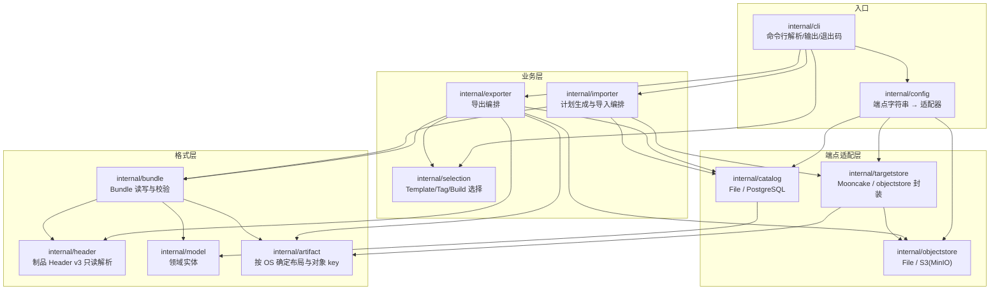
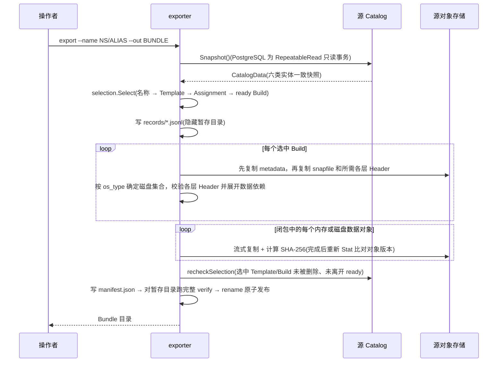

# template-migrate 设计文档

本文对应 `template-migrate` v0.3.1，描述代码架构、功能边界、导入导出流程与
关键设计决策。命令用法见 [usage.md](usage.md),项目简介见 [README.md](README.md)。

---

## 一、目标与设计原则

工具解决一个问题:把 E2B/KASandbox 部署 A 中的 Template(及其 ready Build
的全部制品)搬到部署 B，供支持相同模板运行条件的目标运行时使用。
工具保留原始镜像、快照与版本元数据，不进行 CPU 架构、VMM、内核或 Android
版本转换；迁移校验与目标环境启动 Sandbox 的验收是两个环节。

贯穿全部实现的原则:

1. **Template/Build ID 跨环境恒定**:Template ID、Build UUID 保持不变，
   作为幂等重跑与冲突检测的基础；环境归属及关系行字段按 7.1 转换。
2. **追加式导入(additive-only)**:计划只新建缺失记录和对象，已有内容按
   7.1 的规则复用或报冲突。File/S3 对象写入有仅创建保护，Mooncake 没有
   原子条件写入，需要避免其他进程同时改写本次迁移的对象。
3. **默认 dry-run**:`import` 不加 `--apply` 只产出计划；计划发现冲突时
   不写目标数据，以退出码 `2` 结束。执行中失败的处理边界见 7.2。
4. **导入前强制完整校验**:对象大小、SHA-256、Header 依赖闭包全部通过才
   进入计划阶段。
5. **凭证通过驱动配置**:PostgreSQL 使用 `PGPASSWORD`/`~/.pgpass`，S3 使用
   AWS SDK 凭证链。不要在 URI 中填写密码；工具不会拒绝带密码的 PostgreSQL
   URI，也不提供通用的凭证脱敏保证。
6. **显式格式边界**:Bundle 只接受 `v1/v2`，制品 Header 只接受 `v3`；
   PostgreSQL 校验最低 schema baseline 及实际表结构、约束等能力。
   纯 Linux 导出保持 v1，含 Android 导出使用 v2，不做平台运行时版本转换。

## 二、代码架构



各包职责与要点:

| 包 | 职责 | 要点 |
| --- | --- | --- |
| `cli` | 六个子命令的参数解析、table/json 输出、退出码映射 | 冲突以 `ConflictError` 上抛,映射为退出码 `2` |
| `config` | 把 `--catalog`/`--store` 端点字符串解析为适配器实例 | `postgresql://`、`s3://`、`mooncake://`、本地路径 |
| `selection` | 按选择参数从 Catalog 快照中圈定 Template/Assignment/ready Build | 严格命中检查;结果带确定性指纹 |
| `exporter` | 快照 → 选择 → 对象闭包复制 → manifest 提交 | 见第六节 |
| `importer` | verify → 计划(dry-run)→ 对象发布 → Catalog 提交 | 见第七节 |
| `bundle` | Bundle 目录的写入、inspect(结构)与 verify(全量)校验 | 内容寻址,闭包校验在此复核 |
| `header` | 内存与各盘 Header v3 的只读解析与不变量校验 | 见 6.2;不依赖任何外部包 |
| `model` | Team/Template/Alias/Build/Assignment/SnapshotTemplate 实体 | status↔status_group 领域映射 |
| `artifact` | 从 metadata 判定 OS，定义内存及各磁盘层的 Header/数据 key | Linux 单盘、Android 三盘；与运行时存储路径一致 |
| `catalog` | Catalog 读写:File(JSON)与 PostgreSQL 两种实现 | SQL 全部在 `catalog/sql/*.sql`,见 7.3 |
| `objectstore` | 源端对象存储:File 与 S3/MinIO | `SameObjectVersion` 一致性检查,见 6.3 |
| `targetstore` | 目标对象的检查、发布与提交前复核 | Mooncake 支持关闭写客户端后重建客户端读回；`mooncake` build tag 控制 |
| `testfixture` | 测试专用:运行时生成确定性 Catalog/对象/golden Header | 仓库不提交二进制 fixture |

依赖方向自上而下,无环;`header` 与 `model` 处在最底层。

## 三、功能清单

| 命令 | 作用 | 访问的端点 |
| --- | --- | --- |
| `list` | 列出源端可迁移 Template(目录发现或严格选择) | 源 Catalog |
| `export` | 按选择参数导出 Bundle | 源 Catalog + 源对象存储 |
| `inspect` | 快速校验 Bundle 结构(manifest/记录摘要),不扫大对象 | 仅 Bundle |
| `verify` | 完整校验 Bundle(大小、SHA-256、Header 闭包),完全离线 | 仅 Bundle |
| `import` | dry-run 生成计划;`--apply` 发布对象并提交 Catalog | 目标 Catalog + 目标对象存储 |
| `version` | 显示版本 | 无 |

迁移范围:普通 Template、Snapshot Template、ready Build 及完整对象闭包、
Tag 历史(Assignment)、Alias 与 Namespace 转换。**不含**:Runtime
Snapshot(带实例身份与节点状态,不属于 Template 概念)、非 ready Build、
缺失 Header 的 legacy Build、Mooncake 作为源端、已有模板或对象的清理重导。

File Catalog、本地对象目录、PostgreSQL、S3/MinIO 都是正式端点，源端和目标端
可按 [使用手册](usage.md) 的端点矩阵组合；Mooncake 只实现导入目标适配器。

退出码:`0` 成功(含无冲突 dry-run);`1` 参数/连接/校验/写入错误;
`2` 发现冲突。

## 四、数据模型与校验不变量

Catalog 由六类实体组成,`catalog.Validate` 对每份快照强制以下不变量:

| 实体 | 对应表 | 不变量 |
| --- | --- | --- |
| Team | `teams` | ID/slug 非空,各自唯一 |
| Template | `envs` | ID 唯一,source ∈ {template, snapshot_template},team 引用存在 |
| Alias | `env_aliases` | ID 唯一,(namespace, alias) 唯一(与数据库唯一键同语义),template 引用存在 |
| Build | `env_builds` | ID 唯一,team 引用存在(历史 NULL 容忍),status↔status_group 映射一致 |
| Assignment | `env_build_assignments` | ID 唯一,template/build 引用存在,tag/source 非空 |
| SnapshotTemplate | `snapshot_templates` | 与 template 一对一,只能挂在 snapshot_template 上 |

调用时机有三处:File Catalog 加载后、PostgreSQL 快照读取末尾、导入提交前
(对"现状 + 计划"再校验一次)。目的:File 与 PostgreSQL 两种 Catalog 遵守
同一套不变量,坏数据在**读入口**显式失败,而不是在写出口扩散进目标环境。

每个 ready Build 的控制对象与数据层如下(key 和磁盘集合约定集中在 `internal/artifact`，
数据对象可能位于历史 Build，不能用固定文件数量判断完整性):

| 对象 | 内容 |
| --- | --- |
| `memfile` | 客户机内存镜像数据层 |
| `rootfs.ext4` | 根文件系统数据层 |
| `memfile.header` | 内存镜像的 Header(逻辑区间 → 数据来源映射) |
| `rootfs.ext4.header` | 根文件系统的 Header |
| `persistent.img.header` / `sdcard.img.header` | Android 两块额外磁盘的 Header |
| `persistent.img` / `sdcard.img` | Android 各盘映射引用的数据层 |
| `snapfile` + `metadata.json` | VMM 快照与构建元数据，原始字节保留 |

## 五、Bundle 格式

Bundle 是一个**目录**(非归档文件),布局:

```text
BUNDLE/
├── manifest.json                  # 格式版本、来源信息、选择指纹、计数、
│                                  # 记录/对象清单(含逐文件 SHA-256)
├── records/
│   ├── templates.jsonl            # 每行一个实体,五个记录文件
│   ├── aliases.jsonl
│   ├── builds.jsonl
│   ├── assignments.jsonl
│   └── snapshot-templates.jsonl
├── objects/sha256/XX/HASH         # 内容寻址的对象字节(XX = 摘要前两位)
└── reports/export-report.json     # 导出统计
```

对象按 SHA-256 内容寻址存放,manifest 记录每个逻辑 key(如
`.../memfile.header`)到摘要的映射,同内容对象天然去重。`inspect` 只核对
manifest 与记录文件摘要;`verify` 追加流式读取全部对象核对大小与 SHA-256,
并重算一遍 Header 依赖闭包(见 6.2),确认 Bundle 自洽、可独立于源端使用。

导出根据 `metadata.json` 的 `template.os_type` 判定每个 Build 的磁盘集合。
缺省或 `linux` 使用 rootfs；`android` 使用固定顺序 rootfs.ext4、persistent.img、
sdcard.img，不能依据文件存在与否降级；其他 OS 拒绝。三块盘与内存复用 Header v3。

纯 Linux 导出保持 v1 的字段及摘要编码不变。包含 Android 时输出 v2，增加
`build_layouts: [{build_id, os_type, disks}]`，覆盖所有选中 Build（含混合包中的 Linux）。
布局不写入 Catalog records，不新增数据库字段。`inspect` 校验布局的数量、Build
唯一性、OS 与固定盘名及顺序；`verify` 再从原始 metadata.json 核对 OS，并验证全部
Header 和数据闭包。v1 不允许携带布局；其元数据若是 Android，则明确要求重新导出。
v2 与 v1 复用现有 JSONL 关系记录及内容寻址结构；未知对象类型仍拒绝。

这里有三种不同的“版本”：

| 层次 | 检查或处理 |
| --- | --- |
| 对象存储版本 | S3 VersionID、ETag 等用于发现复制期间的并发改写，见 6.3 |
| 迁移数据格式 | Bundle v1/v2、Header v3，以及 PostgreSQL 最低迁移基线和能力预检 |
| 模板运行条件 | CPU、VMM、内核及 Android 版本信息原样保留，目标环境负责提供匹配运行时 |

读取旧 Linux v1 包不代表能转换任意平台版本。v0.1.x 导出的 Android v1 包缺少
额外磁盘声明和对象，新版会拒绝，必须从源端重新导出完整包。

## 六、导出流程



导出目标目录必须不存在;全部内容先写入同目录下的隐藏暂存目录,最后
`rename` 原子发布,不会留下半成品 Bundle。

### 6.1 export 如何根据 template-name 找到 Build

名称解析链(`internal/selection`):

1. `--name` 与 Alias 的**全限定名** `alias.QualifiedName()` 精确比较
   (Team/literal Alias 为 `NAMESPACE/ALIAS`,全局 Alias 为 `ALIAS`);
   `--name-glob` 同时匹配全限定名和不带 Namespace 的短名;
2. 命中的 Alias 指向 Template(`env_aliases.env_id`);`--template-id`/
   `--all`/`--source-team` 在同一步参与圈定;
3. 由 Template 沿 `env_build_assignments` 找到其全部 Tag 绑定,按
   `--tag`(默认 `default`)或 `--all-tags` 过滤;
4. 每个 (Template, Tag) 按 `--build-scope` 取最新 ready Build(默认)或
   全部历史 ready Build;`--build-id` 则绕过 Tag 直接精确选择;
5. **严格命中检查**:每个显式选择器必须命中至少一个可迁移 Template,
   否则整条命令报错——拼写错误不会静默降级成部分成功。

所以"一个 name"通常对应多个 Build(多 Tag、或 `--build-scope all` 的
历史),它们全部进入同一个 Bundle;选择结果记录确定性指纹,写入 manifest。

### 6.2 为什么必须解析 Header(对象闭包)

KASandbox 的 Build 是**差量存储**:diff Build 的 memfile/rootfs 数据对象里
只有它自己改过的块,其余块由 Header 里的 mapping 指向**其他 Build**(base
链)的数据对象。这条跨 Build 数据依赖**只记录在 Header 字节里**,数据库中
没有任何对应信息:

```text
Build C(diff)的 memfile.header:
  ┌ 逻辑区间 [0, 2MiB)   → Build A 的 memfile,offset 0     ┐
  ├ 逻辑区间 [2, 4MiB)   → 全零(NilUUID),不引用任何对象  ├ 一层即闭包
  └ 逻辑区间 [4, 6MiB)   → Build C 自己的 memfile,offset 0 ┘

导出 Build C 必须同时复制 Build A 的 memfile,否则目标环境的运行时
按 Header 找不到数据 → 模板不可用；只复制文件而不验证依赖的工具会漏掉这种错误。
```

因此导出不能只搬当前 Build 目录。`exporter` 先读取 metadata 的 `os_type`，
再解析内存和每块磁盘的 Header，收集 mapping 引用到的全部
`(BuildID → 同名内存或磁盘层)` 数据对象并复制。Linux 对应内存加 rootfs
两层，Android 对应内存加 rootfs、persistent、sdcard 四层。工具只解析选择
布局及依赖所需字段，metadata、snapfile 和各对象的原始字节仍完整保留。
两个关键性质:

- **闭包只展开一层,不需要递归**:运行时构建 diff 时会把 Header 扁平化
  (未修改的块直接继承祖先 Header 的指向),每条 mapping 都指向数据最终
  所在的 Build;
- **顺带做边界校验**:mapping 的 `BuildStorageOffset + Length` 不得超出
  被引用数据对象的实际大小,防止损坏的 Header 进入 Bundle。

Header v3 的二进制布局(little-endian,64 字节 Metadata + N×40 字节
mapping)与运行时 `packages/shared/pkg/storage/header` 保持一致;工具自带小型只读解析器而不 import 运行时包,因为后者的依赖树
携带 GCP SDK、OTel 等重依赖。字节级一致性由 golden 测试锚定(`internal/testfixture` 运行时
生成,SHA-256 固定)。

### 6.3 复制期间的对象版本一致性

复制一个大对象期间,源对象可能被并发覆盖。`exporter` 的处理:`Open` 时
记录对象身份(S3 VersionID,或 Size+ETag+LastModified;本地文件为
inode/ctime 派生指纹),复制完成后重新 `Stat`,只有
`Info.SameObjectVersion` 判定一致才把这份字节发布进 Bundle,否则整对象
重试并重新计算摘要。

**术语澄清**:`SameObjectVersion` 的"版本"是对象存储(S3 object
versioning)意义上的存储版本。它只判断对象是否在复制期间变化；Bundle v1/v2、
Header v3 和 PostgreSQL schema 的检查各自独立，见第五节。

## 七、导入流程

```mermaid
sequenceDiagram
    participant U as 操作者
    participant I as importer
    participant B as Bundle
    participant C as 目标 Catalog
    participant T as 目标对象存储
    U->>I: import BUNDLE --target-team slug:X [--apply]
    I->>B: bundle.Verify(大小 / SHA-256 / Header 闭包)
    I->>C: 读取目标快照(PostgreSQL 按请求 Build ID 补查孤立行)
    I->>I: prepare:解析目标 Team → 重绑归属字段 → 逐 ID 比对生成计划
    alt 有冲突,或未加 --apply
        I-->>U: 输出计划(冲突退出码 2;dry-run 退出码 0)
    else --apply 且无冲突
        loop 计划新建的每个对象
            I->>T: Publish(核对 Bundle 内容并发布计划新建对象)
        end
        alt Mooncake 目标
            I->>T: 关闭写入客户端，创建独立读取客户端
            I->>T: 全量读回新建与复用对象，校验大小和 SHA-256
        else File 或 S3 目标
            I->>T: Recheck(新建与复用对象的身份未变)
        end
        alt PostgreSQL Catalog
            I->>C: Commit(Serializable:preflight → 重读 → ensureAdditive → INSERT)
        else File Catalog
            I->>C: Commit(Validate → 写临时文件 → Sync → Rename)
        end
        I-->>U: applied=true
    end
```

### 7.1 team_id 如何注入,多次导入为何不冲突

**注入**:`--target-team slug:X|id:UUID` 在目标 Catalog 中解析出 Team
(必须已存在,导入不创建 Team),然后逐记录重写环境归属字段:

| 字段 | 处理 |
| --- | --- |
| `envs.team_id`、`env_builds.team_id` | 改为目标 Team ID |
| `envs.cluster_id` | 改为目标 Team 的 Cluster |
| `envs.created_by` | 置 NULL(源端用户在目标环境无意义) |
| `env_builds.cluster_node_id` | 置 NULL(源端调度节点无跨环境语义) |
| `env_builds.env_id`(`legacy_template_id`) | 新建 Build 时取本包关联该 Build 的最小 Template ID，真实 M:N 关系仍以 Assignment 为准 |
| `env_build_assignments.source` | 新建时固定为 `app` |
| Template/Build ID、资源规格、版本信息、SnapshotTemplate 来源记录 | 保留源值 |
| 记录时间 | 保留源时间；PostgreSQL 以微秒精度存储，幂等比较统一为 UTC 微秒 |

新建 Alias 与 Assignment 时在目标端生成**新 UUID**；复用已有关系行时保留目标 ID。
Alias 的 Namespace 按类型转换:Team-scoped 自动改写为目标 Team slug,
Global 默认跳过(`--include-global-aliases` 显式包含),Literal 必须
`--literal-namespace SOURCE=TARGET` 显式映射。

**幂等**:基础是 Template/Build ID 跨环境恒定。重复导入同一 Bundle 时,
计划阶段按记录类型与目标现状比对：Template/Build 按 ID，Alias 按
`(namespace, alias)`，Assignment 按 Template、Build、Tag 和创建时间定位。

- 目标没有 → 计划新建;
- 目标已有且满足相同判定 → `skip-identical` 策略下计划复用，默认 `fail`
  策略下仍记为冲突；
- 目标已有但不满足 → 计划报告冲突(退出码 2)，不进入写入阶段。

相同判定比较转换后的内容，并折叠后端表示差异：时间统一为 UTC 微秒，Build
忽略兼容字段 `legacy_template_id`，空 CPU flags 与 nil 等价，Reason 按 JSON
语义比较且缺省与 `{}` 等价。Alias 比较 Template 指向与 `is_renamable`；Assignment
要求恰有一条匹配记录且来源为 `app`。对象核对完整内容的大小和 SHA-256。

目标内容未变时，重复导入同一 Bundle 并使用 `skip-identical` 不会新增记录或
对象；File Catalog 仍会执行整文件替换，不能据此推断完全没有文件写入。

### 7.2 跨存储提交顺序

对象存储与数据库无法组成跨存储原子事务,导入按固定顺序把风险压到最低:

1. **对象先行**:先发布全部计划新建的对象。对象 `Put` 只创建不覆盖
   (S3 `If-None-Match:*`,File 硬链接原子发布);Mooncake 无仅创建语义,
   改为发布前 `Exists` 检查 + 逻辑 key 最后写(作为完整性提交点)。
2. **Recheck**:提交 Catalog 前复核每个新建/复用对象仍是刚校验过的版本
   (File/S3 比对对象身份；Mooncake 关闭写入客户端后重建客户端，全量读取 Blob、
   校验 Seekable 元数据及所有 4 MiB 分片并比对 SHA-256)。
3. **Catalog 最后提交**:PostgreSQL 用 Serializable 事务:preflight
   (版本/schema/列/约束/触发器/RLS 逐项核对)→ 重新读取目标现状 →
   `ensureAdditive` 检查当前读到的记录是否都在计划结果中且内容一致，不一致
   时报 `target changed after dry-run` → 仅 INSERT 缺失行。该检查不是从首次
   读取起的完整变更检测；期间被删除的记录可能被重新插入，仍需遵守串行使用前提。

执行中发生写入、复核或提交错误时返回退出码 `1`。对象写入不会自动回滚，
可能留下未被 Catalog 引用的完整对象或分片；处理错误原因后重跑，完整一致的
对象可用 `skip-identical` 复用，损坏或不同的对象仍需核对处理。先复核再提交
Catalog，目的是避免新增元数据引用已知不完整的对象；它不是跨存储原子事务。

普通 import 的 `SnapshotForImport` 按请求 Build UUID 补查无 Assignment 的孤立行，
提前识别主键冲突；源 Snapshot 继续只沿 Assignment 选取 Build。工具不提供删除
Catalog 或清理 Mooncake 对象的恢复流程，冲突和损坏数据由环境维护者核对处理。

### 7.3 PostgreSQL SQL 的组织方式

查询、INSERT 和 preflight SQL 集中维护在 `internal/catalog/sql/`，通过
`go:embed` 引用；Go 侧负责连接、事务、预检、参数绑定、行扫描与追加式提交。
`requiredPostgresColumns` 描述预检所需的列名、类型和可空性。

`sql_spec_test.go` 检查 INSERT 列集合与规格表一致，以及 SELECT 是否引用各
规格列。它不检查 Go 参数绑定或扫描顺序。适配 schema 变化时，除 SQL 和
规格表外，还需按实际变化同步实体、绑定、扫描及迁移语义，并验证数据库读写。

### 7.4 Mooncake 客户端生命周期与高可用地址

迁移客户端是短生命周期进程。如果把它当作存储节点贡献内存，导入对象可能分配
到自身存储段；命令退出后该存储段便不可用。因此 `NewMooncake` 固定向 SDK
`Setup` 传入 `0` 存储容量，不调用 `InitAll`，也不读取 GLOBAL/MOUNT 两个
存储段环境变量。本地传输缓冲独立配置，默认 128 MiB，并不表示提供存储容量。

`Inspect` 对已有对象读取完整内容并计算 SHA-256，用于 `skip-identical` 判定。
apply 发布新对象后，通过 `ClosedWriterVerifier.VerifyAfterClose` 关闭写客户端，
创建同进程中的独立读客户端，对所有新建和复用对象再次全量校验；任一读取失败、
分片缺失、大小或摘要不一致都会阻止 Catalog 提交。native 读取使用注册过的 mmap
缓冲，关闭客户端后释放；客户端关闭与校验的顺序由 importer 和 targetstore 协同保证。

控制面预检分别处理 `MOONCAKE_MASTER_ADDR` 和 `MOONCAKE_METADATA_SERVER`。
除单地址外，支持 `etcd://HOST:PORT;HOST:PORT` 等多端点形式，分号或逗号均可。
各列表按顺序尝试连接，每个地址超时 3 秒；两个列表都至少一个地址可达才进入
SDK Setup。预检只提取地址检查 TCP 可达性，完整原串继续交给 SDK，由 SDK
执行服务发现等协议逻辑。工具不自行实现 Master 选举或故障切换；TCP 成功也
不能证明认证、etcd 服务发现和数据传输已经通过。

## 八、数据格式常量与客户端资源参数

Header、分片和寻址布局需要与运行时读端一致；客户端资源参数按迁移进程的
生命周期选择，不能直接照搬长期运行的存储节点。源码位置以主仓
`packages/shared/pkg/storage` 及本模块为准：

| 工具中的常量/行为 | 值 | 运行时出处 | 性质 |
| --- | --- | --- | --- |
| Header 版本 | v3,64+40×N 字节,little-endian | `header/serialization.go`、`header/mapping.go` | 数据格式,必须一致 |
| memfile 块大小 | 运行时通常为 2 MiB(大页) | `header/diff.go` `HugepageSize` | 工具读取 Header 中的 BlockSize 并校验映射对齐，不硬编码此值 |
| 磁盘块大小 | 运行时通常为 4 KiB | orchestrator 模板存储 | 同样按各盘 Header 的 BlockSize 校验 |
| Mooncake 分片大小 | 4 MiB | `storage.go` `MemoryChunkSize` | 应用层协议:读端缓冲池按此固定分配,唯一安全值 |
| Mooncake 分片寻址 | `KEY#c#OFFSET`,逻辑 key 存 size/chunk_size 元数据 | `storage_mooncake.go` | 应用层协议,编译在读端,无在线查询接口 |
| 迁移客户端存储容量 | 固定 0 | `targetstore/mooncake_native.go` | 短生命周期客户端不参与存储分配，忽略 GLOBAL/MOUNT 环境变量且不调用 InitAll |
| `MOONCAKE_LOCAL_BUFFER_SIZE` 默认 | 128 MiB | `storage_mooncake.go` | 客户端传输缓冲，环境变量优先；必须为正整数字节数 |
| schema baseline | `20260218120000` | 数据库迁移序列 | 兼容下限,preflight 校验 |

不直接 import 运行时包取这些常量,原因同 6.2(重依赖);对齐靠出处注释 +
golden 测试锚定。

## 九、构建形态与平台

- **仅支持 Linux**:与运行时同平台;本地文件对象身份使用
  inode/device/ctime(`syscall.Stat_t`),不做跨平台兜底。
- **Mooncake 构建**:`build.sh` 以 `-tags mooncake` 在 Linux/ARM64 原生
  构建 `bin/template-migrate`。Mooncake 客户端为 CGO 绑定,只显式链接
  libmooncake_store 与 libmooncake_common(传递依赖由动态链接器解析),
  头文件只需 store_c.h,位置可用 `MOONCAKE_INCLUDE_DIR` 指定。
- **普通构建**不带 `mooncake` tag：可正式用于 File/PostgreSQL/S3 迁移；
  Mooncake 支持编译为 stub，收到 `mooncake://` 端点显式报错。
- **开发自测**：单元测试在 Linux(含 WSL)运行，不依赖外部服务；测试数据全部由
  `internal/testfixture` 运行时生成，仓库不提交二进制 fixture。
- 本地 File Catalog/对象存储端点是与 PostgreSQL/S3/Mooncake 同级的
  **正式端点形态**;KASandbox 生产环境的典型路径为 PostgreSQL + S3/MinIO
  (源)→ PostgreSQL + Mooncake(目标)。

## 十、并发模型与已知限制

按**单操作者串行**使用设计:

- 同一目标不要并行 `import`:File Catalog 提交是整文件原子替换,并行导入
  会互相覆盖;Mooncake 写入无仅创建保护,并行导入同一 namespace 可能交错
  覆盖分片。PostgreSQL 目标有 Serializable 事务防护,但对象侧仍以串行为
  前提。导入期间也应避免其他进程修改本次涉及的 Catalog 记录和对象；事务不覆盖
  对象发布及初次读取目标快照的整个时间窗口。
- 导出期间源端可以继续读写:大对象复制不持有数据库事务,结束时
  `recheckSelection` 只检查会使快照失效的删除与 ready 状态漂移;期间新增
  的 Tag/Alias 留给下一次导出。
- Mooncake 不能作为源端(读取能力用于导入校验，未实现源端导出适配器);缺失 Header 的 legacy Build
  不支持迁移(报 `legacy_headerless_build`)。
